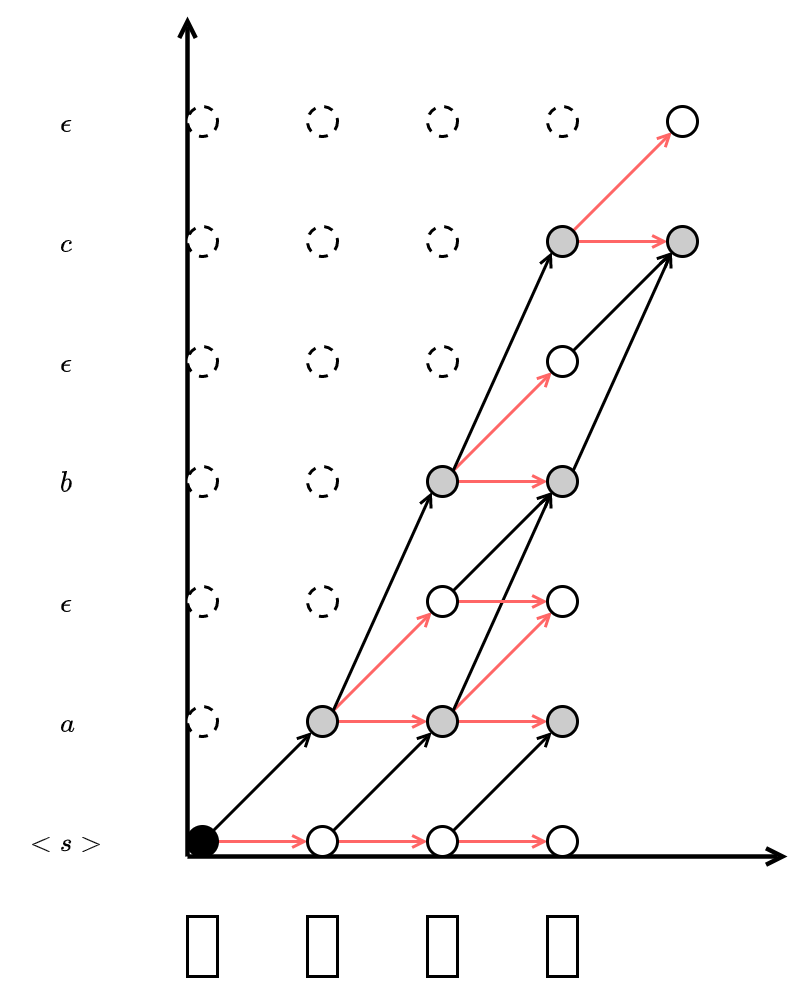

# PyTorch bindings for CUDA-Warp CTC-Transducer loss

**This is NOT CTC, neither RNN-T.**

The CTC is first proposed by Alex Graves, et, al. ([Connectionist Temporal Classification: Labelling Unsegmented Sequence Data with Recurrent Neural Networks](https://www.cs.toronto.edu/~graves/icml_2006.pdf)). The vanilla CTC takes the probabilities of sequence distribution by frames as input, with the assumption that frames are independent. Later in 2012, Graves proposed **RNN-T**([Sequence Transduction with Recurrent Neural Networks](https://arxiv.org/abs/1211.3711)), which considers the connection between labels.

In frame alignment, CTC and RNN-T are similar, but different:

- CTC: remove consecutive repeated tokens then remove blanks (`a <b> a a <b> b b -> a a b`);
- RNN-T: remove blanks (`a a <b> b c -> a b c`).

Basically, what we call **CTC-T** (CTC Transducer) is a combination of RNN-T and CTC, which considers label context like RNN-T and does frame alignment like CTC. The idea is also referred in literature ([Sequence Transduction with Graph-based Supervision](https://arxiv.org/abs/2111.01272) and [An Investigation of Monotonic Transducers for Large-Scale Automatic Speech Recognition](https://arxiv.org/abs/2204.08858) draws a pretty lattice figure.)



## Usage

Please refer to the python module entry: `warp_ctct/__init__.py`

## Requirements

- C++14 compiler (tested with GCC 7.5).
- Python: 3.5+ (tested with version 3.9).
- [PyTorch](http://pytorch.org/) >= 1.11.0 (tested with version 1.12.1).
- [CUDA Toolkit](https://developer.nvidia.com/cuda-zone) (tested with version 11.7).


## Install

The following setup instructions compile the package from the source code locally.

```bash
# install from github
pip install git+https://github.com/maxwellzh/warp-ctct.git
```


## Reference

- Alex Graves [Connectionist Temporal Classification: Labelling Unsegmented Sequence Data with Recurrent Neural Networks](https://www.cs.toronto.edu/~graves/icml_2006.pdf)

- Alex Graves [Sequence transduction with recurrent neural network](https://arxiv.org/pdf/1211.3711.pdf)

- Niko Moritz, Takaaki Hori and et, al. [Sequence Transduction with Graph-based Supervision](https://arxiv.org/abs/2111.01272)

- Niko Moritz [An Investigation of Monotonic Transducers for Large-Scale Automatic Speech Recognition](https://arxiv.org/abs/2204.08858)

- Ivan Sorokin [warp-rnnt](https://github.com/1ytic/warp-rnnt)
